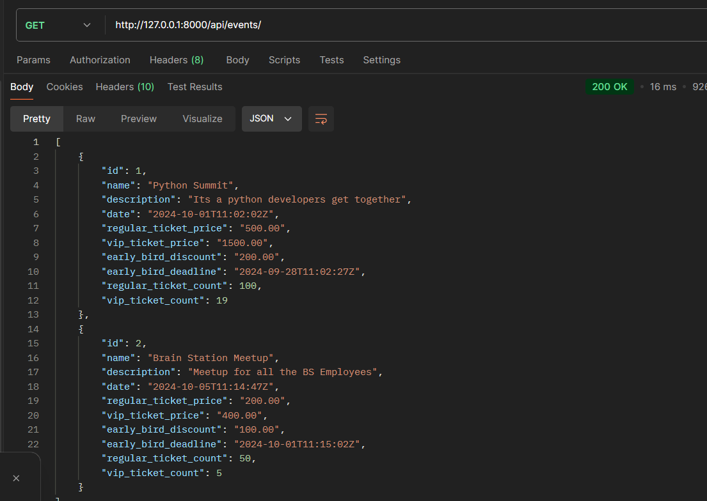
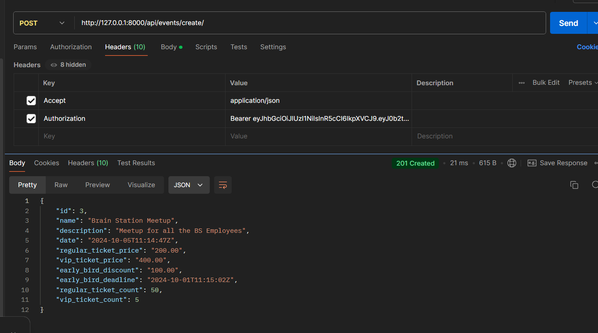

## To Run this Project without docker follow below:
```
for windows:
python -m venv env
env\Scripts\activate
pip install -r requirements.txt
python manage.py makemigrations
python manage.py migrate
python manage.py runserver
```
Create event: 
```
http://127.0.0.1:8000/api/events/create/

output
{
    "id": 3,
    "name": "Brain Station Meetup",
    "description": "Meetup for all the BS Employees",
    "date": "2024-10-05T11:14:47Z",
    "regular_ticket_price": "200.00",
    "vip_ticket_price": "400.00",
    "early_bird_discount": "100.00",
    "early_bird_deadline": "2024-10-01T11:15:02Z",
    "regular_ticket_count": 50,
    "vip_ticket_count": 5
}
```
Book Event: 
```
http://127.0.0.1:8000/api/events/book/
```
##for event list



##Create Event Admin User 

